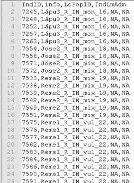
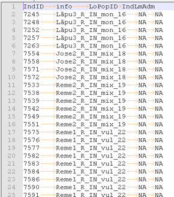

# Text files, text editors and regular expressions

## Text vs binary files

At the very basic level there are two types of computer files: text files and everything else, usually called binary files. Loosely speaking text files contain lines of text, very little else, and are human readable, while the content of binary files is not human readable, but it has to be interpreted by a dedicated program to convey information meaningful for the user. The distinction between text and binary files may, at the beginning, seem a bit vague, but hopefully things will become clearer as we move on.

Text files (sometimes called also plain text) are commonly used for storing and exchanging various types of information. Therefore an understanding of their structure, types and quirks is essential for any biologist.

We'll start with an example.
To make things confusing, files we usually open and save in one of the most popular text editing program, MS Word, are actually not text files, but rather binary files containing text. When open in MS Word the file looks like this:

When we open the same file in Windows Notepad, dedicated for plain text, we see this:

Not really useful, huh?
Only when we ask MS Word to save this file as text (try it under Save As...) we get a text file per se.
Interesting things appear when we ask Word to save this as text file - there are a few questions to answer, some choices related to encoding and end of lines. Obviously there's something more to learn about text files. After saving the file as text, we can see its content in Notepad:

## Notepad ++
To explore text files in more detail we need an appropriate tool. In this class we'll use Notepad++ for Windows. If you use Mac or Linux you should contact your course instructure for alternatives. For the rest of the class we'll assume that you have Notepad++ installed on your system. You can get it [here](https://notepad-plus-plus.org/downloads/), you will probably want to install the newest 64-bit version. Please install the English language version.

Notepad++ is a plain text editor with many features, today we will use only a few to learn more about the nature of text files.

## End-of-line and other non-printable characters

Download file from [here](https://www.dropbox.com/s/stfdyaudt0dg0lb/Text_file_01.txt?dl=0), save it in your course directory, run Notepad++ and open the file. You should see something like this:

There are two lines of text in the file. When you select `View -> Show Symbol -> Show All Characters`, you will see, in addition to text some extra symbols. These are small dots in place of whitespaces between words and letters `CR` and `LF` on black background at the end of the lines. Actually these are two normally invisible characters that are inserted into a text file when you press <kbd>Enter</kbd> to end a line of text. Unfortunately end-of-line (EOL) symbols are system-specific, in Windows they are `CRLF`, in Mac `LFCR` and in Linux `LF` only. Although it may seem jaust a curiosity and in many situations it indeed doesn't matter, we're introducing this information here becauseit is a common enough source of frustration. Things don't work as they should although everything seems in order, and the the problem turns out to be in the type of end of line. The problem is easy to fix if you are aware of it.

In Notepad++ you can easily do EOL conversion selecting from menu: `Edit -> EOL Conversion`. Some programs, as MS Word give you the option of various EOL types when saving as plain text.

Another important non-printable character is tabulator or **tab** that you insert by pressing <kbd>TAB</kbd>. In Notepad++ it isnormally  displayed as an ornge arrow, but many other programs don't display anything. 

## Encoding

As most of early development of computters occurred in English-speaking countries, the character sets supported were English, or more generally speaking Latin alphabet-centric. In early days of text files only slightly more than 200 (or evel less than 100) printable characters were available in the ASCII standard. This led to the development of various text encoding standards to represnt various alphabets and sets of characteres. These were usually not intercompatible. Fortunately now a de facto standard called UTF-8 exists. It is fully compatible with ASCII, as ASCII is a subset of UTF-8. UTF-8 has an enormous capacity - it can represent more than 1 million characters. Currently ca. 150 thousands are in use, details can be found [here](https://www.unicode.org/versions/stats/). The full set of UTF-8 characters together with their codes, i.e., numbers that represent each character, can be found [here](https://www.utf8-chartable.de/)
Try to always use UTF-8.

> ### Insert an UTF-8 character in Notepad++
> So how to get access to this huge number of UTF-8 characters? Under Windows probably the simplest way is to use
 Character Map program which is installed by default. For example to insert small Greek &#x03B1; character, find its Unicode code point (`03B1`) go to Character Map, enter this code in `Go to Unicode` field, then `Select` and `Copy` and then the character can be pasted into Notepad++. The method is a bit cumbersome, but it gives you access to any UTF-8 characters, however exotic. During this course we'll learn also about other methods.
 
 
## Delimited text

Information stored in text files is often structured. One of the most commons ways of structuring information is in a way similar to what you see in spreasheets, where observations are in rows and various attributes of observations are in columns, that is a row contains multiple fields (see also previous class). This kind of information can easily be represented in delimited text files. In such files a special character is used to delimit fields. Two types of delimited text files are the most popular: 
* csv or comma separated values - here comma (`,`) is used as field separator. However in some languages, e.g., in Polish, `,` is used as the decimal point in numbers. Therefore a dialect of csv exists that uses semicolon (`;`) as delimiter. The csv is extremely popular, but one needs to remember about its dialects to avoid unexpected results. A clear advantage of csv is that the delimiter is always a visible character. An example of csv as displayed in Notepad ++:  
* tsv or tab separated values - here <kbd>TAB</kbd> is used as delimiter. <kbd>TAB</kbd>, often represented as `\t` is normally not a visible character, which sometimes makes recognition of tab-separated files not so straightforward. On the other hand, tsv files are often easier to read and there is no problem with dialects. **Important !** <kbd>TAB</kbd> is different from <kbd>SPACE</kbd> and you should **NEVER** try to used multiple spaces instead of <kbd>TAB</kbd>. An example of tsv as displayed in Notepad ++:  

## Regular expressions

Regular expressions or regexp allow us to look for patterns in text files. They are an extremely powerful and versatile tool and we'll encounter them over and over again during this course. Here a gentle introduction, some examples and exercises.

> ### Regular expression symbols
> 
> Below are the most common symbols, for a more complete list see [here](https://www.regular-expressions.info/refquick.html)
> 
> `.` any single character
> 
> `?` preceding character occured 0 or 1 times (`Bla?` will match `Bl` or `Bla` but not `Blaa`)
> 
> `*` preceding character occurred 0 or more times (`Bla*` will match `Bl`, `Bla` or `Blaa`)
> 
> `+` preceding character occurred 1 or more times (`Bla+` will match `Bla` or `Blaa`, but not `Bl`)
> 
> `\{n\}`   preceding character occurred exactly n times
> 
> `\{n,m\}`  preceding character occured at least n times, but not more than m times
> 
> `[abc]` any single character from a set
> 
> `[^abc]` any single character **not** from a set
> 
> `[a-j]` any single character from a range (other examples `[A-Z]`, `[0-9]` etc.)
>
> `^` beginning of line
>
> `$` end of line
> 
> `()` parentheses can be used to group patterns. As we see below parentheses are also use to **capture** parts of expresion for subsequent use.
>
> `|` alternative (`Bl(a|e)` will match `Bla` or `Ble`, it's equivalent to `Bl[ae]`; `cat|dog` will match `cat` or `dog`)
> 
> If you want to search for a character that has a special meaning, e.g., `*`, you should **escape** it with `\`, for exaple to look for `*` use `\*` and to look for tab use `\t`.
> 
> **Important** unfortunately there are some differences in implementation of regular expressions between programs. These differences are not large, but can matter in everyday life. You'll find a complete reference [here](https://www.regular-expressions.info/reference.html), and we'll also highlight the issue throughout the course.

### Exercise 1

Download text file from [here]() and open it in Notepad++. The file contains information about height of persons and animals. Use Notepad++ `Search -> Find...`  with `Search Mode` set to `Regular expression` and `Match case` field checked to find the following (and write down the reular expressions you used):
* persons with (given) name starting with L (L at the start of line)
* persons with (given) name starting with L or animals with species name staring with l (L or l at the start of line)
* persons/animals taller than 2 meters (tip use alternative and parentheses to group expressions)

> ### Searching and repleacing with regular expressions
> You can capture a part of regular expression for subsequent use. This allows using regular expressions to find patterns and modify them. Imagine that you have three binomial Latin species names:
> `Rana arvalis 
> Rana delmatina
> Rana temporaria`

### Exercice 2
Download text file from [here](https://www.dropbox.com/s/gruaw8vqgnwas8l/Ex_02_2.txt?dl=0) and open it in Notepad++. This file contains long lines, you can toggle line wrapping selecting from menu `View -> Word wrap`. Answer the following questions
* what type of delimited file is this (csv, tsv, other?)
* what type of EOL it has?
* the first column contains 4-digit individual id, the second column contains information about species, population (as name and number) and geographic region in the form of `_` separated fields in the form `popID_region_species_popNr`. Use regular expressions with Notepad++ `Search -> Replace ...` to change the order of the fields in the second column to `species_region_popID_popNr`.
